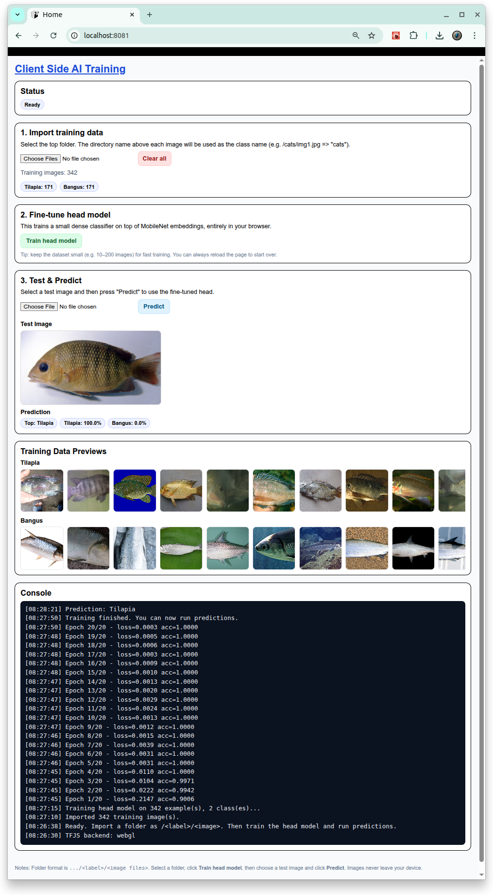

# [Client Side AI Training Environment](https://github.com/europanite/client_side_ai_training_environment "Client Side AI Training Environment")

[](https://opensource.org/licenses/Apache-2.0)

[](https://github.com/europanite/client_side_ai_training_environment/actions/workflows/ci.yml)
[](https://github.com/europanite/client_side_ai_training_environment/actions/workflows/docker.yml)
[](https://github.com/europanite/client_side_ai_training_environment/actions/workflows/pages.yml)


<p align="right">
  <a href="./README.md">🇺🇸 English</a> |
  <a href="./README.hi.md">🇮🇳 हिंदी</a> |
  <a href="./README.ja.md">🇯🇵 日本語</a> |
  <a href="./README.zh-CN.md">🇨🇳 简体中文</a> |
  <a href="./README.es.md">🇪🇸 Español</a> |
  <a href="./README.pt-BR.md">🇧🇷 Português (Brasil)</a> |
  <a href="./README.ko.md">🇰🇷 한국어</a> |
  <a href="./README.de.md">🇩🇪 Deutsch</a> |
  <a href="./README.fr.md">🇫🇷 Français</a>
</p>



 [PlayGround](https://europanite.github.io/client_side_ai_training_environment/)

TensorFlow.js MobileNet 上に構築された、ブラウザベースの画像 AI 転移学習プレイグラウンド。

Client Side AI Training Environment は、**TensorFlow.js MobileNet** 上で画像分類を試すための **ブラウザベースのプレイグラウンド** です。  
ラベル付き画像フォルダを自分でインポートし、ブラウザ内だけで小さな分類ヘッドを学習させ、予測を実行できます — **画像をどのサーバーにも送信しません**。

---

## ✨ 機能

- **クライアントサイド学習のみ**  
  - ブラウザ内で TensorFlow.js を使用します。学習にバックエンドや外部 API は不要です。

- **MobileNet 上での転移学習**  
  - 事前学習済みの MobileNet モデルを読み込み、埋め込みを抽出します。
  - データセット上で小さな dense 分類ヘッド（softmax 付きの全結合層）を学習します。

- **フォルダベースのデータセットインポート**  
  - `/DATA_DIRECTORY/<class_name>/<images...>` のようなフォルダツリーをインポートできます。
  - クラス名はディレクトリ名から自動的に取得されます。
  - クラスごとの画像数とプレビューサムネイルを表示します。

- **ステップごとの UI**  
  - **1. Import training data**（ラベル付き画像フォルダ）  
  - **2. Train head model** を MobileNet の特徴量上で実行  
  - **3. Test & Predict** を別のテスト画像で実行

- **デフォルトでプライバシー重視**  
  - すべての計算とデータはブラウザタブ内に留まります。  
  - ユーザー画像に対するネットワーク I/O はありません（手動でスクリーンショットやログを共有する場合を除きます）。

- **Expo Web アプリとして動作**  
  - Web にエクスポートされる Expo / React Native アプリとして実装されており、  
    `/client_side_ai_training_environment` で GitHub Pages 経由で配信されます。

---

## 🧰 仕組み

内部では、このアプリは次の流れで動作します。

1. **MobileNet（ベースモデル）を読み込む**  
   - 起動時に、アプリは TensorFlow.js 経由で MobileNet v2 を読み込み、利用可能であれば WebGL バックエンドを準備します。

2. **ラベル付き画像をフォルダとしてインポートする**  
   - Web では、次のようなフォルダを選択できます。
     - `DATA_DIRECTORY/cats/*.jpg`
     - `DATA_DIRECTORY/dogs/*.png`
   - 親ディレクトリ名（例: `cats`, `dogs`）がクラスラベルになります。

3. **特徴量を抽出し、分類ヘッドを学習する（転移学習）**  
   - 各学習画像について、MobileNet を使って埋め込みベクトルを計算します。
   - 小さな `tf.sequential()` モデルが次の構成で作成されます。
     - Dense layer（例: 128 units, ReLU）
     - Dropout
     - 全クラスに対する softmax 付きの最終 dense layer
   - ヘッドは categorical cross-entropy と Adam optimizer で学習されます。
   - これは古典的な **転移学習** の構成です。ベースネットワーク（MobileNet）は凍結され、自分のデータで分類ヘッドだけが学習されます。

4. **テスト画像で予測を実行する**  
   - 別のテスト画像を MobileNet に通して埋め込みを取得します。
   - ヘッドモデルがクラス確率を予測します。
   - UI には次の内容が表示されます。
     - 最上位の予測ラベル
     - Top-k クラス信頼度（パーセンテージ）

ベースモデルは凍結され、分類ヘッドだけがブラウザ内で学習されるため、学習は

---

## Data

### Sample Data
- https://www.robots.ox.ac.uk/~vgg/data/flowers/
-https://fishnet-2023.github.io/

### Data Structure

<pre>
DATA_DIRECTORY
├── CLASS_NAME_1
│   ├── image_01.png
│   ├── image_02.png
│   ├── image_03.png
│   ├── ...
├── CLASS_NAME_2
│   ├── image_01.png
│   ├── image_02.png
│   ├── image_03.png
│   ├── ...
├── CLASS_NAME_3
│   ├── image_01.png
│   ├── image_02.png
│   ├── image_03.png
│   ├── ...
 ...

</pre>

Web では、最上位フォルダ（例: DATA_DIRECTORY）を選択します。
アプリはツリーをたどり、フォルダ名からラベルを推定し、ラベルごとの画像数を数えます。

---

## 推奨環境

- モダンなデスクトップブラウザ（Chrome、Edge、または Firefox）
- WebGL が有効であること（TensorFlow.js の GPU アクセラレーション用）。
- ファイルシステムからアクセス可能なローカル画像フォルダ。

注: 一部のモバイルブラウザはフォルダアップロード（webkitdirectory）をサポートしていない場合があり、体験が制限されることがあります。

---

## 🚀 はじめに

### 1. 前提条件
- [Docker Compose](https://docs.docker.com/compose/)

### 2. すべてのサービスをビルドして起動します。

```bash
# set environment variables:
export REACT_NATIVE_PACKAGER_HOSTNAME=${YOUR_HOST}

# Build the image
docker compose build

# Run the container
docker compose up
```

### 3. テスト:
```bash
docker compose \
-f docker-compose.test.yml up \
--build --exit-code-from \
frontend_test 
```

---

# ライセンス
- Apache License 2.0
