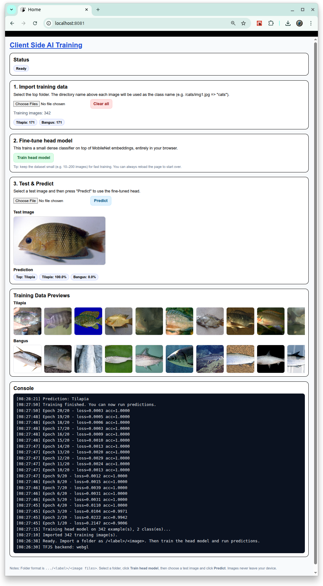

# [Client Side AI Training](https://github.com/europanite/client_side_ai_training "Client Side AI Training")

[](https://www.python.org/)


[](https://github.com/europanite/client_side_ai_training/actions/workflows/ci.yml)
[](https://github.com/europanite/client_side_ai_training/actions/workflows/docker.yml)
[](https://github.com/europanite/client_side_ai_training/actions/workflows/deploy-pages.yml)



 [PlayGround](https://europanite.github.io/client_side_ai_training/)

A Browser-Based Image AI Transfer Learning Playground  built on TensorFlow.js MobileNet. 

Client Side AI Training is a **browser-based playground** for experimenting with
image classification on top of **TensorFlow.js MobileNet**.  
You can import your own labeled image folders, train a small classifier head entirely
in the browser, and run predictions — **without sending your images to any server**.

---

## ✨ Features

- **Client-side training only**  
  - Uses TensorFlow.js in the browser. No backend or external APIs are required for training.

- **Transfer learning on top of MobileNet**  
  - Loads a pre-trained MobileNet model and extracts embeddings.
  - Trains a small dense classifier head (fully connected layers with softmax) on your dataset.

- **Folder-based dataset import**  
  - Import a folder tree such as `/DATA_DIRECTORY/<class_name>/<images...>`.
  - Class names are automatically derived from directory names.
  - Shows per-class image counts and preview thumbnails.

- **Step-by-step UI**  
  - **1. Import training data** (folder of labeled images)  
  - **2. Train head model** on top of MobileNet features  
  - **3. Test & Predict** with a separate test image

- **Privacy by default**  
  - All computation and data stay inside the browser tab.  
  - No network I/O for user images (unless you manually share screenshots or logs).

- **Works as an Expo Web app**  
  - Implemented as an Expo / React Native app that is exported to the web  
    and served via GitHub Pages at `/client_side_ai_training`.

---

## 🧰 How It Works

Under the hood, the app follows this flow:

1. **Load MobileNet (base model)**  
   - On startup, the app loads MobileNet v2 via TensorFlow.js and prepares the WebGL backend if available.

2. **Import labeled images as a folder**  
   - On the web, you can select a folder that looks like:
     - `DATA_DIRECTORY/cats/*.jpg`
     - `DATA_DIRECTORY/dogs/*.png`
   - The parent directory name (e.g., `cats`, `dogs`) becomes the class label.

3. **Extract features & train a classifier head (transfer learning)**  
   - For each training image, MobileNet is used to compute an embedding vector.
   - A small `tf.sequential()` model is created with:
     - Dense layer (e.g., 128 units, ReLU)
     - Dropout
     - Final dense layer with softmax over all classes
   - The head is trained with categorical cross-entropy and Adam optimizer.
   - This is a classic **transfer learning** setup: the base network (MobileNet) is frozen, and only the classifier head is trained on your data.

4. **Run predictions on a test image**  
   - A separate test image is passed through MobileNet to get an embedding.
   - The head model predicts class probabilities.
   - The UI displays:
     - Top predicted label
     - Top-k class confidences as percentages

Because the base model is frozen and only the classifier head is trained in the browser, training is

---

## Data Structure

<pre>
DATA_DIRECTORY
├── CLASS_NAME_1
│   ├── image_01.png
│   ├── image_02.png
│   ├── image_03.png
│   ├── ...
├── CLASS_NAME_2
│   ├── image_01.png
│   ├── image_02.png
│   ├── image_03.png
│   ├── ...
├── CLASS_NAME_3
│   ├── image_01.png
│   ├── image_02.png
│   ├── image_03.png
│   ├── ...
 ...
 
</pre>

On the web, you select the top-level folder (e.g., DATA_DIRECTORY).
The app walks the tree, infers labels from folder names, and counts images per label.

---

## Recommended environment

- A Modern desktop browser (Chrome, Edge, or Firefox)
- WebGL enabled (for TensorFlow.js GPU acceleration).
- Local image folders accessible from your file system.

Note: Some mobile browsers may not support folder upload (webkitdirectory) or may offer a degraded experience.

---

## 🚀 Getting Started

### 1. Prerequisites
- [Docker Compose](https://docs.docker.com/compose/)

### 2. Build and start all services:

```bash
# set environment variables:
export REACT_NATIVE_PACKAGER_HOSTNAME=${YOUR_HOST}

# Build the image
docker compose build

# Run the container
docker compose up
```

### 3. Test:
```bash
docker compose \
-f docker-compose.test.yml up \
--build --exit-code-from \
frontend_test 
```

---

# License
- Apache License 2.0